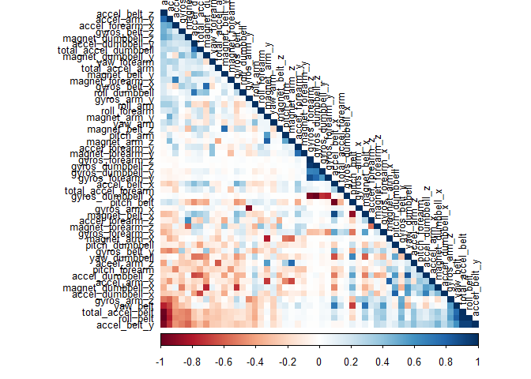
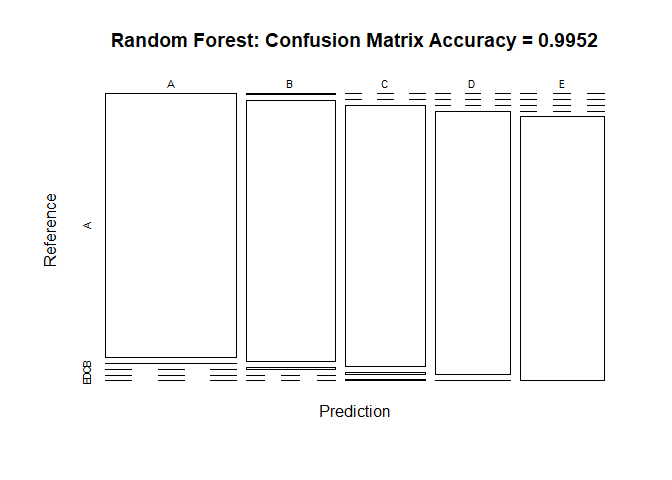

Practical Machine Learning Assignment
================
David Treisman
March 27, 2019

1. Overview
-----------

The purpose of the assignment is is to use data from quantified self movement sensors to predict the manner in which 6 participants did weight lifting exercises - referred to in the training set as the "classe" variable. In order to undertake the prediction any of the other available variables may be used in the prediction model.

This report describes the steps taken in building a prediction model, cross validation, determining the expected out of sample error and so forth. Ultimately the prediction model will be used to predict 20 different test cases.

2. Data
-------

Unconventionally the assignment provides and uses 2 seperate datasets (a training set and a testing set) from the start as opposed to splitting the dataset into training and testing after cleaning but prior to the application of any machine learning models.

The data for this assignment comes from the following source: <http://groupware.les.inf.puc-rio.br/har>. The training data used in this assignment was downloaded into the local folder from: <https://d396qusza40orc.cloudfront.net/predmachlearn/pml-training.csv> The test data used in this assignment was downloaded into the local folder from: <https://d396qusza40orc.cloudfront.net/predmachlearn/pml-testing.csv>

3. Loading Libraries and Data
-----------------------------

The necessary libraries are loaded together with the training and testing datasets. The general characteristics of the raw training dataset will be compared to that of the RAW testing set.

``` r
library(lattice)
library(ggplot2)
library(caret)
library(corrplot)
```

    ## corrplot 0.84 loaded

``` r
library(knitr)
library(rattle)
```

    ## Rattle: A free graphical interface for data science with R.
    ## Version 5.2.0 Copyright (c) 2006-2018 Togaware Pty Ltd.
    ## Type 'rattle()' to shake, rattle, and roll your data.

``` r
library(randomForest)
```

    ## randomForest 4.6-14

    ## Type rfNews() to see new features/changes/bug fixes.

    ## 
    ## Attaching package: 'randomForest'

    ## The following object is masked from 'package:rattle':
    ## 
    ##     importance

    ## The following object is masked from 'package:ggplot2':
    ## 
    ##     margin

``` r
library(rpart)
library(rpart.plot)

set.seed(55555)

trainingRAW<- read.csv("pml-training.csv")
testingRAW<- read.csv("pml-testing.csv")

dim(trainingRAW)
```

    ## [1] 19622   160

``` r
str(trainingRAW)
```

    ## 'data.frame':    19622 obs. of  160 variables:
    ##  $ X                       : int  1 2 3 4 5 6 7 8 9 10 ...
    ##  $ user_name               : Factor w/ 6 levels "adelmo","carlitos",..: 2 2 2 2 2 2 2 2 2 2 ...
    ##  $ raw_timestamp_part_1    : int  1323084231 1323084231 1323084231 1323084232 1323084232 1323084232 1323084232 1323084232 1323084232 1323084232 ...
    ##  $ raw_timestamp_part_2    : int  788290 808298 820366 120339 196328 304277 368296 440390 484323 484434 ...
    ##  $ cvtd_timestamp          : Factor w/ 20 levels "02/12/2011 13:32",..: 9 9 9 9 9 9 9 9 9 9 ...
    ##  $ new_window              : Factor w/ 2 levels "no","yes": 1 1 1 1 1 1 1 1 1 1 ...
    ##  $ num_window              : int  11 11 11 12 12 12 12 12 12 12 ...
    ##  $ roll_belt               : num  1.41 1.41 1.42 1.48 1.48 1.45 1.42 1.42 1.43 1.45 ...
    ##  $ pitch_belt              : num  8.07 8.07 8.07 8.05 8.07 8.06 8.09 8.13 8.16 8.17 ...
    ##  $ yaw_belt                : num  -94.4 -94.4 -94.4 -94.4 -94.4 -94.4 -94.4 -94.4 -94.4 -94.4 ...
    ##  $ total_accel_belt        : int  3 3 3 3 3 3 3 3 3 3 ...
    ##  $ kurtosis_roll_belt      : Factor w/ 397 levels "","-0.016850",..: 1 1 1 1 1 1 1 1 1 1 ...
    ##  $ kurtosis_picth_belt     : Factor w/ 317 levels "","-0.021887",..: 1 1 1 1 1 1 1 1 1 1 ...
    ##  $ kurtosis_yaw_belt       : Factor w/ 2 levels "","#DIV/0!": 1 1 1 1 1 1 1 1 1 1 ...
    ##  $ skewness_roll_belt      : Factor w/ 395 levels "","-0.003095",..: 1 1 1 1 1 1 1 1 1 1 ...
    ##  $ skewness_roll_belt.1    : Factor w/ 338 levels "","-0.005928",..: 1 1 1 1 1 1 1 1 1 1 ...
    ##  $ skewness_yaw_belt       : Factor w/ 2 levels "","#DIV/0!": 1 1 1 1 1 1 1 1 1 1 ...
    ##  $ max_roll_belt           : num  NA NA NA NA NA NA NA NA NA NA ...
    ##  $ max_picth_belt          : int  NA NA NA NA NA NA NA NA NA NA ...
    ##  $ max_yaw_belt            : Factor w/ 68 levels "","-0.1","-0.2",..: 1 1 1 1 1 1 1 1 1 1 ...
    ##  $ min_roll_belt           : num  NA NA NA NA NA NA NA NA NA NA ...
    ##  $ min_pitch_belt          : int  NA NA NA NA NA NA NA NA NA NA ...
    ##  $ min_yaw_belt            : Factor w/ 68 levels "","-0.1","-0.2",..: 1 1 1 1 1 1 1 1 1 1 ...
    ##  $ amplitude_roll_belt     : num  NA NA NA NA NA NA NA NA NA NA ...
    ##  $ amplitude_pitch_belt    : int  NA NA NA NA NA NA NA NA NA NA ...
    ##  $ amplitude_yaw_belt      : Factor w/ 4 levels "","#DIV/0!","0.00",..: 1 1 1 1 1 1 1 1 1 1 ...
    ##  $ var_total_accel_belt    : num  NA NA NA NA NA NA NA NA NA NA ...
    ##  $ avg_roll_belt           : num  NA NA NA NA NA NA NA NA NA NA ...
    ##  $ stddev_roll_belt        : num  NA NA NA NA NA NA NA NA NA NA ...
    ##  $ var_roll_belt           : num  NA NA NA NA NA NA NA NA NA NA ...
    ##  $ avg_pitch_belt          : num  NA NA NA NA NA NA NA NA NA NA ...
    ##  $ stddev_pitch_belt       : num  NA NA NA NA NA NA NA NA NA NA ...
    ##  $ var_pitch_belt          : num  NA NA NA NA NA NA NA NA NA NA ...
    ##  $ avg_yaw_belt            : num  NA NA NA NA NA NA NA NA NA NA ...
    ##  $ stddev_yaw_belt         : num  NA NA NA NA NA NA NA NA NA NA ...
    ##  $ var_yaw_belt            : num  NA NA NA NA NA NA NA NA NA NA ...
    ##  $ gyros_belt_x            : num  0 0.02 0 0.02 0.02 0.02 0.02 0.02 0.02 0.03 ...
    ##  $ gyros_belt_y            : num  0 0 0 0 0.02 0 0 0 0 0 ...
    ##  $ gyros_belt_z            : num  -0.02 -0.02 -0.02 -0.03 -0.02 -0.02 -0.02 -0.02 -0.02 0 ...
    ##  $ accel_belt_x            : int  -21 -22 -20 -22 -21 -21 -22 -22 -20 -21 ...
    ##  $ accel_belt_y            : int  4 4 5 3 2 4 3 4 2 4 ...
    ##  $ accel_belt_z            : int  22 22 23 21 24 21 21 21 24 22 ...
    ##  $ magnet_belt_x           : int  -3 -7 -2 -6 -6 0 -4 -2 1 -3 ...
    ##  $ magnet_belt_y           : int  599 608 600 604 600 603 599 603 602 609 ...
    ##  $ magnet_belt_z           : int  -313 -311 -305 -310 -302 -312 -311 -313 -312 -308 ...
    ##  $ roll_arm                : num  -128 -128 -128 -128 -128 -128 -128 -128 -128 -128 ...
    ##  $ pitch_arm               : num  22.5 22.5 22.5 22.1 22.1 22 21.9 21.8 21.7 21.6 ...
    ##  $ yaw_arm                 : num  -161 -161 -161 -161 -161 -161 -161 -161 -161 -161 ...
    ##  $ total_accel_arm         : int  34 34 34 34 34 34 34 34 34 34 ...
    ##  $ var_accel_arm           : num  NA NA NA NA NA NA NA NA NA NA ...
    ##  $ avg_roll_arm            : num  NA NA NA NA NA NA NA NA NA NA ...
    ##  $ stddev_roll_arm         : num  NA NA NA NA NA NA NA NA NA NA ...
    ##  $ var_roll_arm            : num  NA NA NA NA NA NA NA NA NA NA ...
    ##  $ avg_pitch_arm           : num  NA NA NA NA NA NA NA NA NA NA ...
    ##  $ stddev_pitch_arm        : num  NA NA NA NA NA NA NA NA NA NA ...
    ##  $ var_pitch_arm           : num  NA NA NA NA NA NA NA NA NA NA ...
    ##  $ avg_yaw_arm             : num  NA NA NA NA NA NA NA NA NA NA ...
    ##  $ stddev_yaw_arm          : num  NA NA NA NA NA NA NA NA NA NA ...
    ##  $ var_yaw_arm             : num  NA NA NA NA NA NA NA NA NA NA ...
    ##  $ gyros_arm_x             : num  0 0.02 0.02 0.02 0 0.02 0 0.02 0.02 0.02 ...
    ##  $ gyros_arm_y             : num  0 -0.02 -0.02 -0.03 -0.03 -0.03 -0.03 -0.02 -0.03 -0.03 ...
    ##  $ gyros_arm_z             : num  -0.02 -0.02 -0.02 0.02 0 0 0 0 -0.02 -0.02 ...
    ##  $ accel_arm_x             : int  -288 -290 -289 -289 -289 -289 -289 -289 -288 -288 ...
    ##  $ accel_arm_y             : int  109 110 110 111 111 111 111 111 109 110 ...
    ##  $ accel_arm_z             : int  -123 -125 -126 -123 -123 -122 -125 -124 -122 -124 ...
    ##  $ magnet_arm_x            : int  -368 -369 -368 -372 -374 -369 -373 -372 -369 -376 ...
    ##  $ magnet_arm_y            : int  337 337 344 344 337 342 336 338 341 334 ...
    ##  $ magnet_arm_z            : int  516 513 513 512 506 513 509 510 518 516 ...
    ##  $ kurtosis_roll_arm       : Factor w/ 330 levels "","-0.02438",..: 1 1 1 1 1 1 1 1 1 1 ...
    ##  $ kurtosis_picth_arm      : Factor w/ 328 levels "","-0.00484",..: 1 1 1 1 1 1 1 1 1 1 ...
    ##  $ kurtosis_yaw_arm        : Factor w/ 395 levels "","-0.01548",..: 1 1 1 1 1 1 1 1 1 1 ...
    ##  $ skewness_roll_arm       : Factor w/ 331 levels "","-0.00051",..: 1 1 1 1 1 1 1 1 1 1 ...
    ##  $ skewness_pitch_arm      : Factor w/ 328 levels "","-0.00184",..: 1 1 1 1 1 1 1 1 1 1 ...
    ##  $ skewness_yaw_arm        : Factor w/ 395 levels "","-0.00311",..: 1 1 1 1 1 1 1 1 1 1 ...
    ##  $ max_roll_arm            : num  NA NA NA NA NA NA NA NA NA NA ...
    ##  $ max_picth_arm           : num  NA NA NA NA NA NA NA NA NA NA ...
    ##  $ max_yaw_arm             : int  NA NA NA NA NA NA NA NA NA NA ...
    ##  $ min_roll_arm            : num  NA NA NA NA NA NA NA NA NA NA ...
    ##  $ min_pitch_arm           : num  NA NA NA NA NA NA NA NA NA NA ...
    ##  $ min_yaw_arm             : int  NA NA NA NA NA NA NA NA NA NA ...
    ##  $ amplitude_roll_arm      : num  NA NA NA NA NA NA NA NA NA NA ...
    ##  $ amplitude_pitch_arm     : num  NA NA NA NA NA NA NA NA NA NA ...
    ##  $ amplitude_yaw_arm       : int  NA NA NA NA NA NA NA NA NA NA ...
    ##  $ roll_dumbbell           : num  13.1 13.1 12.9 13.4 13.4 ...
    ##  $ pitch_dumbbell          : num  -70.5 -70.6 -70.3 -70.4 -70.4 ...
    ##  $ yaw_dumbbell            : num  -84.9 -84.7 -85.1 -84.9 -84.9 ...
    ##  $ kurtosis_roll_dumbbell  : Factor w/ 398 levels "","-0.0035","-0.0073",..: 1 1 1 1 1 1 1 1 1 1 ...
    ##  $ kurtosis_picth_dumbbell : Factor w/ 401 levels "","-0.0163","-0.0233",..: 1 1 1 1 1 1 1 1 1 1 ...
    ##  $ kurtosis_yaw_dumbbell   : Factor w/ 2 levels "","#DIV/0!": 1 1 1 1 1 1 1 1 1 1 ...
    ##  $ skewness_roll_dumbbell  : Factor w/ 401 levels "","-0.0082","-0.0096",..: 1 1 1 1 1 1 1 1 1 1 ...
    ##  $ skewness_pitch_dumbbell : Factor w/ 402 levels "","-0.0053","-0.0084",..: 1 1 1 1 1 1 1 1 1 1 ...
    ##  $ skewness_yaw_dumbbell   : Factor w/ 2 levels "","#DIV/0!": 1 1 1 1 1 1 1 1 1 1 ...
    ##  $ max_roll_dumbbell       : num  NA NA NA NA NA NA NA NA NA NA ...
    ##  $ max_picth_dumbbell      : num  NA NA NA NA NA NA NA NA NA NA ...
    ##  $ max_yaw_dumbbell        : Factor w/ 73 levels "","-0.1","-0.2",..: 1 1 1 1 1 1 1 1 1 1 ...
    ##  $ min_roll_dumbbell       : num  NA NA NA NA NA NA NA NA NA NA ...
    ##  $ min_pitch_dumbbell      : num  NA NA NA NA NA NA NA NA NA NA ...
    ##  $ min_yaw_dumbbell        : Factor w/ 73 levels "","-0.1","-0.2",..: 1 1 1 1 1 1 1 1 1 1 ...
    ##  $ amplitude_roll_dumbbell : num  NA NA NA NA NA NA NA NA NA NA ...
    ##   [list output truncated]

``` r
dim (testingRAW)
```

    ## [1]  20 160

``` r
str(testingRAW)
```

    ## 'data.frame':    20 obs. of  160 variables:
    ##  $ X                       : int  1 2 3 4 5 6 7 8 9 10 ...
    ##  $ user_name               : Factor w/ 6 levels "adelmo","carlitos",..: 6 5 5 1 4 5 5 5 2 3 ...
    ##  $ raw_timestamp_part_1    : int  1323095002 1322673067 1322673075 1322832789 1322489635 1322673149 1322673128 1322673076 1323084240 1322837822 ...
    ##  $ raw_timestamp_part_2    : int  868349 778725 342967 560311 814776 510661 766645 54671 916313 384285 ...
    ##  $ cvtd_timestamp          : Factor w/ 11 levels "02/12/2011 13:33",..: 5 10 10 1 6 11 11 10 3 2 ...
    ##  $ new_window              : Factor w/ 1 level "no": 1 1 1 1 1 1 1 1 1 1 ...
    ##  $ num_window              : int  74 431 439 194 235 504 485 440 323 664 ...
    ##  $ roll_belt               : num  123 1.02 0.87 125 1.35 -5.92 1.2 0.43 0.93 114 ...
    ##  $ pitch_belt              : num  27 4.87 1.82 -41.6 3.33 1.59 4.44 4.15 6.72 22.4 ...
    ##  $ yaw_belt                : num  -4.75 -88.9 -88.5 162 -88.6 -87.7 -87.3 -88.5 -93.7 -13.1 ...
    ##  $ total_accel_belt        : int  20 4 5 17 3 4 4 4 4 18 ...
    ##  $ kurtosis_roll_belt      : logi  NA NA NA NA NA NA ...
    ##  $ kurtosis_picth_belt     : logi  NA NA NA NA NA NA ...
    ##  $ kurtosis_yaw_belt       : logi  NA NA NA NA NA NA ...
    ##  $ skewness_roll_belt      : logi  NA NA NA NA NA NA ...
    ##  $ skewness_roll_belt.1    : logi  NA NA NA NA NA NA ...
    ##  $ skewness_yaw_belt       : logi  NA NA NA NA NA NA ...
    ##  $ max_roll_belt           : logi  NA NA NA NA NA NA ...
    ##  $ max_picth_belt          : logi  NA NA NA NA NA NA ...
    ##  $ max_yaw_belt            : logi  NA NA NA NA NA NA ...
    ##  $ min_roll_belt           : logi  NA NA NA NA NA NA ...
    ##  $ min_pitch_belt          : logi  NA NA NA NA NA NA ...
    ##  $ min_yaw_belt            : logi  NA NA NA NA NA NA ...
    ##  $ amplitude_roll_belt     : logi  NA NA NA NA NA NA ...
    ##  $ amplitude_pitch_belt    : logi  NA NA NA NA NA NA ...
    ##  $ amplitude_yaw_belt      : logi  NA NA NA NA NA NA ...
    ##  $ var_total_accel_belt    : logi  NA NA NA NA NA NA ...
    ##  $ avg_roll_belt           : logi  NA NA NA NA NA NA ...
    ##  $ stddev_roll_belt        : logi  NA NA NA NA NA NA ...
    ##  $ var_roll_belt           : logi  NA NA NA NA NA NA ...
    ##  $ avg_pitch_belt          : logi  NA NA NA NA NA NA ...
    ##  $ stddev_pitch_belt       : logi  NA NA NA NA NA NA ...
    ##  $ var_pitch_belt          : logi  NA NA NA NA NA NA ...
    ##  $ avg_yaw_belt            : logi  NA NA NA NA NA NA ...
    ##  $ stddev_yaw_belt         : logi  NA NA NA NA NA NA ...
    ##  $ var_yaw_belt            : logi  NA NA NA NA NA NA ...
    ##  $ gyros_belt_x            : num  -0.5 -0.06 0.05 0.11 0.03 0.1 -0.06 -0.18 0.1 0.14 ...
    ##  $ gyros_belt_y            : num  -0.02 -0.02 0.02 0.11 0.02 0.05 0 -0.02 0 0.11 ...
    ##  $ gyros_belt_z            : num  -0.46 -0.07 0.03 -0.16 0 -0.13 0 -0.03 -0.02 -0.16 ...
    ##  $ accel_belt_x            : int  -38 -13 1 46 -8 -11 -14 -10 -15 -25 ...
    ##  $ accel_belt_y            : int  69 11 -1 45 4 -16 2 -2 1 63 ...
    ##  $ accel_belt_z            : int  -179 39 49 -156 27 38 35 42 32 -158 ...
    ##  $ magnet_belt_x           : int  -13 43 29 169 33 31 50 39 -6 10 ...
    ##  $ magnet_belt_y           : int  581 636 631 608 566 638 622 635 600 601 ...
    ##  $ magnet_belt_z           : int  -382 -309 -312 -304 -418 -291 -315 -305 -302 -330 ...
    ##  $ roll_arm                : num  40.7 0 0 -109 76.1 0 0 0 -137 -82.4 ...
    ##  $ pitch_arm               : num  -27.8 0 0 55 2.76 0 0 0 11.2 -63.8 ...
    ##  $ yaw_arm                 : num  178 0 0 -142 102 0 0 0 -167 -75.3 ...
    ##  $ total_accel_arm         : int  10 38 44 25 29 14 15 22 34 32 ...
    ##  $ var_accel_arm           : logi  NA NA NA NA NA NA ...
    ##  $ avg_roll_arm            : logi  NA NA NA NA NA NA ...
    ##  $ stddev_roll_arm         : logi  NA NA NA NA NA NA ...
    ##  $ var_roll_arm            : logi  NA NA NA NA NA NA ...
    ##  $ avg_pitch_arm           : logi  NA NA NA NA NA NA ...
    ##  $ stddev_pitch_arm        : logi  NA NA NA NA NA NA ...
    ##  $ var_pitch_arm           : logi  NA NA NA NA NA NA ...
    ##  $ avg_yaw_arm             : logi  NA NA NA NA NA NA ...
    ##  $ stddev_yaw_arm          : logi  NA NA NA NA NA NA ...
    ##  $ var_yaw_arm             : logi  NA NA NA NA NA NA ...
    ##  $ gyros_arm_x             : num  -1.65 -1.17 2.1 0.22 -1.96 0.02 2.36 -3.71 0.03 0.26 ...
    ##  $ gyros_arm_y             : num  0.48 0.85 -1.36 -0.51 0.79 0.05 -1.01 1.85 -0.02 -0.5 ...
    ##  $ gyros_arm_z             : num  -0.18 -0.43 1.13 0.92 -0.54 -0.07 0.89 -0.69 -0.02 0.79 ...
    ##  $ accel_arm_x             : int  16 -290 -341 -238 -197 -26 99 -98 -287 -301 ...
    ##  $ accel_arm_y             : int  38 215 245 -57 200 130 79 175 111 -42 ...
    ##  $ accel_arm_z             : int  93 -90 -87 6 -30 -19 -67 -78 -122 -80 ...
    ##  $ magnet_arm_x            : int  -326 -325 -264 -173 -170 396 702 535 -367 -420 ...
    ##  $ magnet_arm_y            : int  385 447 474 257 275 176 15 215 335 294 ...
    ##  $ magnet_arm_z            : int  481 434 413 633 617 516 217 385 520 493 ...
    ##  $ kurtosis_roll_arm       : logi  NA NA NA NA NA NA ...
    ##  $ kurtosis_picth_arm      : logi  NA NA NA NA NA NA ...
    ##  $ kurtosis_yaw_arm        : logi  NA NA NA NA NA NA ...
    ##  $ skewness_roll_arm       : logi  NA NA NA NA NA NA ...
    ##  $ skewness_pitch_arm      : logi  NA NA NA NA NA NA ...
    ##  $ skewness_yaw_arm        : logi  NA NA NA NA NA NA ...
    ##  $ max_roll_arm            : logi  NA NA NA NA NA NA ...
    ##  $ max_picth_arm           : logi  NA NA NA NA NA NA ...
    ##  $ max_yaw_arm             : logi  NA NA NA NA NA NA ...
    ##  $ min_roll_arm            : logi  NA NA NA NA NA NA ...
    ##  $ min_pitch_arm           : logi  NA NA NA NA NA NA ...
    ##  $ min_yaw_arm             : logi  NA NA NA NA NA NA ...
    ##  $ amplitude_roll_arm      : logi  NA NA NA NA NA NA ...
    ##  $ amplitude_pitch_arm     : logi  NA NA NA NA NA NA ...
    ##  $ amplitude_yaw_arm       : logi  NA NA NA NA NA NA ...
    ##  $ roll_dumbbell           : num  -17.7 54.5 57.1 43.1 -101.4 ...
    ##  $ pitch_dumbbell          : num  25 -53.7 -51.4 -30 -53.4 ...
    ##  $ yaw_dumbbell            : num  126.2 -75.5 -75.2 -103.3 -14.2 ...
    ##  $ kurtosis_roll_dumbbell  : logi  NA NA NA NA NA NA ...
    ##  $ kurtosis_picth_dumbbell : logi  NA NA NA NA NA NA ...
    ##  $ kurtosis_yaw_dumbbell   : logi  NA NA NA NA NA NA ...
    ##  $ skewness_roll_dumbbell  : logi  NA NA NA NA NA NA ...
    ##  $ skewness_pitch_dumbbell : logi  NA NA NA NA NA NA ...
    ##  $ skewness_yaw_dumbbell   : logi  NA NA NA NA NA NA ...
    ##  $ max_roll_dumbbell       : logi  NA NA NA NA NA NA ...
    ##  $ max_picth_dumbbell      : logi  NA NA NA NA NA NA ...
    ##  $ max_yaw_dumbbell        : logi  NA NA NA NA NA NA ...
    ##  $ min_roll_dumbbell       : logi  NA NA NA NA NA NA ...
    ##  $ min_pitch_dumbbell      : logi  NA NA NA NA NA NA ...
    ##  $ min_yaw_dumbbell        : logi  NA NA NA NA NA NA ...
    ##  $ amplitude_roll_dumbbell : logi  NA NA NA NA NA NA ...
    ##   [list output truncated]

It appears that the RAW training and testing datasets have similar elements and indicates that application of any cleaning procedures applied to the RAW training data can appropriately be applied to the RAW testing dataset.

It is revealed that much of the RAW training dataset of 19622 observations and 160 variables consists of data with N/A values and time related data (columns 1 to 7) that are exogenous to the scope of the study.

Note the RAW testing dataset consists of 20 observations and 160 variables.

4. Preprocessing/Cleaning of Data
---------------------------------

Thus, given 2 seperate datasets, the process for cleaning the RAW training dataset in terms of removing N/A values and time related data will also be applied to the RAW testing set. As we proceed through the cleaning process we will display the dimension of the reduced dataset.

First we **remove the N/A values**:

``` r
CleanTrainSet<- trainingRAW[, colSums(is.na(trainingRAW)) == 0]
CleanTestSet <- testingRAW[, colSums(is.na(testingRAW)) == 0]
dim(CleanTrainSet)
```

    ## [1] 19622    93

``` r
dim(CleanTestSet)
```

    ## [1] 20 60

Please note the reduction of the number of observations and variables in both sets. This indicates some cleaning of the data has occurred.

Second we **remove the time related data** (columns 1 to 7):

``` r
CleanTrainSet<- CleanTrainSet[, -c(1:7)]
CleanTestSet <-CleanTestSet[, -c(1:7)]
dim(CleanTrainSet)
```

    ## [1] 19622    86

``` r
dim(CleanTestSet)
```

    ## [1] 20 53

Again, please note the reduction of the number of observations and variables in both sets. This indicates some cleaning of the data has occurred.

5. Exploratory Data Analysis
----------------------------

### 5.1 Splitting the Training Set

In order to apply machine learning models the cleaned training set was further subsetted into a 70 percent training and 30 percent testing sets referred to as 'SplitTrain' and 'SplitTest' respectively.

``` r
TrainSubSet <- createDataPartition(CleanTrainSet$classe, p=0.7, list=FALSE)
SplitTrain <- CleanTrainSet[TrainSubSet,]
SplitTest <- CleanTrainSet[-TrainSubSet,]
dim(SplitTrain)
```

    ## [1] 13737    86

``` r
dim(SplitTest)
```

    ## [1] 5885   86

### 5.2 Exploring Correlation

In order to explore whether some highly correlated variables can be excluded from the analysis we investigate correlation within the 'SplitTrain' dataset. This will be undertaken by first removing near zero variance and then plotting a correlogram:

``` r
NZV <- nearZeroVar(SplitTrain)
SplitTrain <- SplitTrain[, -NZV]
SplitTest  <- SplitTest[, -NZV]
dim(SplitTrain)
```

    ## [1] 13737    53

``` r
dim(SplitTest)
```

    ## [1] 5885   53

``` r
corMatrix <- cor(SplitTrain[, -53])
corrplot(corMatrix, order = "FPC", 
          method = "color", 
            type = "lower", 
              tl.cex = 0.8, 
                tl.col = rgb(0, 0, 0))
```



**There are indications of high correlation in certain instances. This would suggest that the applied machine learning model should be that of random forests as it is capable of prediction under multicollinearity.**

6. Prediction Model with Cross-Validation
-----------------------------------------

As multicollinearity has been found in the dataset, we undertake apply Random Forests as the prediction model. Cross-validation is also undertaken as oulined in the confusion matrix and related figure.

``` r
FitRandForest <- randomForest(classe ~ ., data=SplitTrain)
FitRandForest
```

    ## 
    ## Call:
    ##  randomForest(formula = classe ~ ., data = SplitTrain) 
    ##                Type of random forest: classification
    ##                      Number of trees: 500
    ## No. of variables tried at each split: 7
    ## 
    ##         OOB estimate of  error rate: 0.55%
    ## Confusion matrix:
    ##      A    B    C    D    E  class.error
    ## A 3903    2    0    0    1 0.0007680492
    ## B   13 2642    3    0    0 0.0060195636
    ## C    0   15 2379    2    0 0.0070951586
    ## D    1    0   25 2223    3 0.0128774423
    ## E    0    0    3    7 2515 0.0039603960

``` r
PredictRandForest <- predict(FitRandForest, newdata=SplitTest)
confMatRandForest <- confusionMatrix(PredictRandForest, SplitTest$classe)
confMatRandForest
```

    ## Confusion Matrix and Statistics
    ## 
    ##           Reference
    ## Prediction    A    B    C    D    E
    ##          A 1671    4    0    0    0
    ##          B    3 1135    8    0    0
    ##          C    0    0 1018    7    4
    ##          D    0    0    0  957    2
    ##          E    0    0    0    0 1076
    ## 
    ## Overall Statistics
    ##                                           
    ##                Accuracy : 0.9952          
    ##                  95% CI : (0.9931, 0.9968)
    ##     No Information Rate : 0.2845          
    ##     P-Value [Acc > NIR] : < 2.2e-16       
    ##                                           
    ##                   Kappa : 0.994           
    ##  Mcnemar's Test P-Value : NA              
    ## 
    ## Statistics by Class:
    ## 
    ##                      Class: A Class: B Class: C Class: D Class: E
    ## Sensitivity            0.9982   0.9965   0.9922   0.9927   0.9945
    ## Specificity            0.9991   0.9977   0.9977   0.9996   1.0000
    ## Pos Pred Value         0.9976   0.9904   0.9893   0.9979   1.0000
    ## Neg Pred Value         0.9993   0.9992   0.9984   0.9986   0.9988
    ## Prevalence             0.2845   0.1935   0.1743   0.1638   0.1839
    ## Detection Rate         0.2839   0.1929   0.1730   0.1626   0.1828
    ## Detection Prevalence   0.2846   0.1947   0.1749   0.1630   0.1828
    ## Balanced Accuracy      0.9986   0.9971   0.9950   0.9962   0.9972

``` r
plot(confMatRandForest$table, 
     col = confMatRandForest$byClass, 
      main = paste("Random Forest: Confusion Matrix Accuracy =",
        round(confMatRandForest$overall['Accuracy'], 
          4)))
```



Given the high degree of **accuracy (0.9952)** and low **out-of-sample error rate (0.0048)**, we apply the prediction model to the 20 case testing dataset.

7. Prediction of the 20 Case Testing Dataset ('CleanTestSet')
-------------------------------------------------------------

``` r
PredictCleanTest <- predict(FitRandForest, newdata=CleanTestSet)
PredictCleanTest
```

    ##  1  2  3  4  5  6  7  8  9 10 11 12 13 14 15 16 17 18 19 20 
    ##  B  A  B  A  A  E  D  B  A  A  B  C  B  A  E  E  A  B  B  B 
    ## Levels: A B C D E
